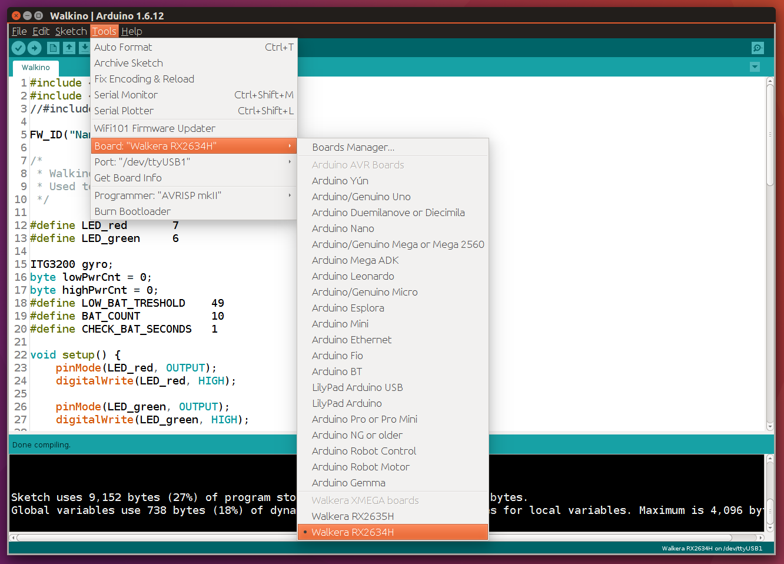

# Walkino
Programming your Walkera R/C receiver with the
Arduino IDE.

## Objectives
Basic idea for this project was to develop
alternate firmwares for some Walkera R/C receivers. After analyzing two popular receivers,
one the RX2634H from the [QR-Ladybird](https://www.google.com/search?q=qr-ladybird&tbm=isch) and the
other the RX2635H from the [Hoten-X](https://www.google.com/search?q=hoten-x&tbm=isch) both based
on the Atmel [XMEGA32A4](http://www.atmel.com/devices/ATXMEGA32A4.aspx) it looked feasible that
this could be done.

And whats the easiest way today to develop
software for microcontroller? Right, it's the
Arduino IDE. So this project provides all
thats needed to integrate these board into the
Arduino IDE.

Successful test where performed with IDEs version 1.6.5 up to
the current version (as of this writing) 1.6.12.
Linux and Windows are equally supported, MAC OS was not
tested.

Additional information about the hardware of
both receivers as well as for this project
could be found in a series of blog posts
about [Walkino](https://www.min.at/prinz/?x=cat:510).

Even if you are not into R/C quadcopters this
project could be interesting. The boards are
relatively cheap available on platforms like
amazon or ebay and provide a great platform
for Atmel XMEGA based development and contain
a lot of interesting sensors.

## Installation
First install [Arduino IDE](https://www.arduino.cc/en/Main/Software).
Next you have two options to install this project.

1. Download the distribution ZIP file end extract it
   into the root directory of the Arduino IDE (the folder
   which contains the file **arduino** which starts the
   IDE).

2. The other way is to clone the GIT repository
   right into this folder. This has the advantage
   that updates could be easily done using **git update**.

Both methods do not overwrite or change any files of
the standard IDE installation and can be completely
removed using the provided **walkino-remove.sh** (for Linux or
**walkino-remove.cmd** for Windows) script.

Included in this project are compiled binaries of
the [UP42](https://github.com/rprinz08/UP42) utility
which is needed to transfer compiled sketches to
the receiver. You could also compile it yourself
from source for security reasons if you want.
Versions for Windows and Linux are provided as 32bit and 64bit
binaries. If you are on a 32bit system you have to
manually rename the 32bit versions **up42-32** to
**up42** as the default is 64bit. These utilities
could be found in the **hardware/tools/walkera/linux**
or **hardware/tools/walkera/windows** folders inside the
Arduino IDE folder.

To connect the receiver boards to the development PC
either an original Walkera UP02 or a USB to serial
converter is needed. More infos about that topic are
available [here](https://www.min.at/prinz/?x=entry:entry150622-125650)
and [here](https://www.min.at/prinz/?x=entry:entry161004-215304).

## Usage

Select one of the two new boards which are available After
installation under the **Tools/Board** menu. Then select
the serial port where the board is connected.

To start you can select one of the available examples
under menu **File / Examples / Walkino**

## Contributing / Developing
Walkino is not 100% complete or bug free. If you found
any bug or have an idea for improvements - great! Feel
free to contribute.

1. Fork it on github!
2. Create your feature branch: `git checkout -b my-new-feature`
3. Commit your changes: `git commit -am 'Add some feature'`
4. Push to the branch: `git push origin my-new-feature`
5. Submit a pull request :-)

To start development no dependencies except the Arduino
IDE are needed. I personally develop using [Visual Studio
Code](https://code.visualstudio.com) as an editor and this project includes a workspace
settings folder for it. If you prefer another editor just
ignore this folder.

1. Open root folder of Arduino IDE with vscode and start coding.
   Especially files under **hardware/walkera/xmega/** are relevant if
   you would like to understand or modify things.
2. Press CTRL+SHIFT+B in vscode builds project dist ZIP
   file.

## Notes
Most of the receivers hardware is already supported by
Walkino. Serial port, red LED on RX2635H and red/green
LED on RX2634H, two I2C and one SPI bus works. Components
like ITG-3205 mems gyro and MMA-8452 are accessible via
I2C and libraries are included. The wireless USB CYRF-6936 is accessible
via SPI but currently not supported as no library is included
in Walkino. Also measuring the current battery voltage is
supported.

The used receiver boards still use the original Walkera
bootloader so it's possible to flash back original Walkera
receiver firmware and use them for which they were intended:
as R/C quadcopter receivers.

The original bootloader supports the feature to specify an
80 byte identification string which is shown by the bootloader
ID command. Such an ID could be specified with the
**FW_ID** preprocessor macro. Any string can be used as long as it
is less then or equal to 80 bytes (including NULL C-string
termination character) and starts with **"Name:"**. It's valid
if the ID does not start with "Name:". In such a case the
bootloader does not report it back and uses an empty string
instead (even if the ID is included in the firmware).

## History
* Alpha Version 17.2.2016
* First Public Beta 7.10.2016

## Credits
Credits go to all used components libraries.
Especially for some parts of
https://github.com/XMegaForArduino/arduino

Portions of this work are from the XMegaForArduino
project and are Copyright (c) 2015 by S.F.T. Inc. - all rights reserved

## License
This software is provided 'as-is' with no
warranty, implied or otherwise.

**Walkino** copyright richard.prinz@min.at 2015, 2016

This project is under GNU GPLv3.
See file gpl-3.0-walkino.txt in this project or
http://www.gnu.org/licenses/gpl-3.0.html

